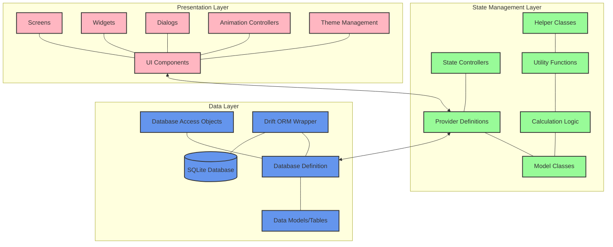
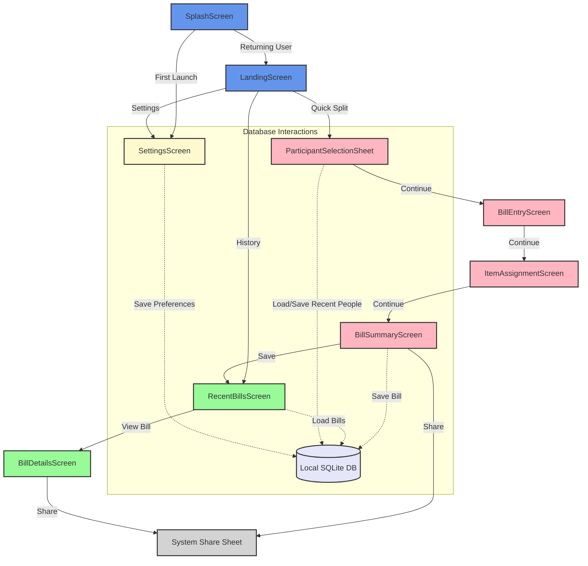
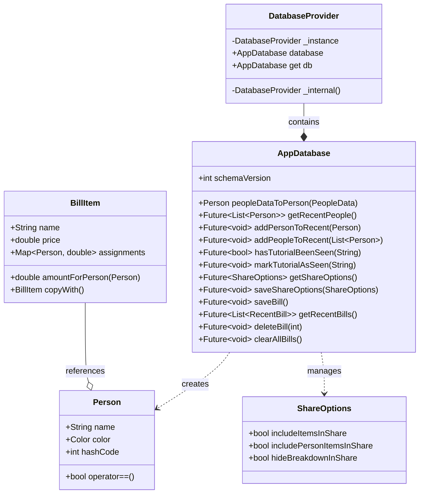
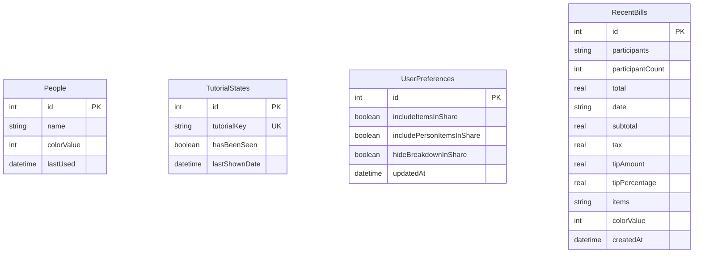
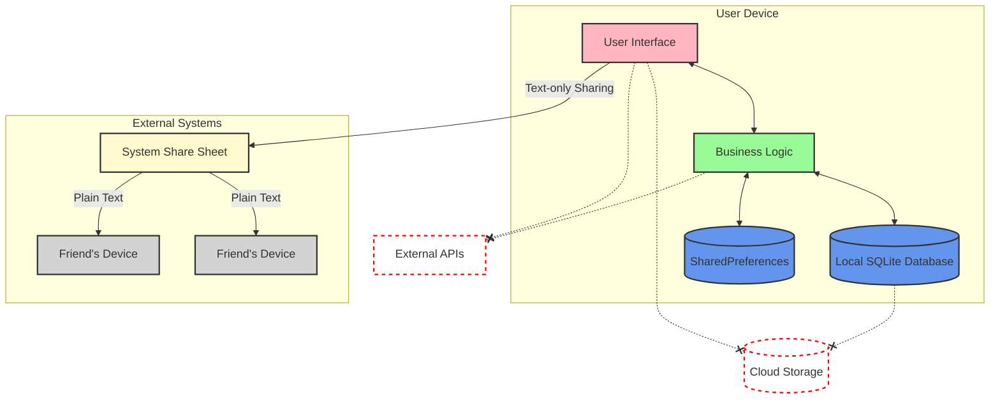
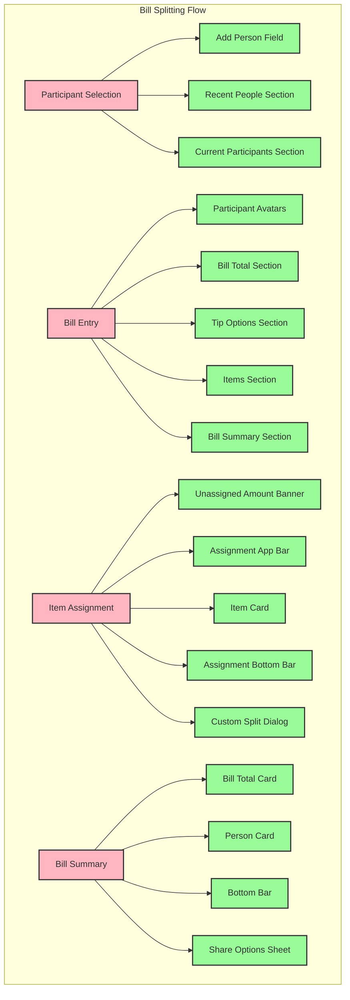

# Checkmate Architecture

## Overview

Checkmate implements a privacy-focused receipt splitting app with a modular, maintainable architecture. This document outlines the architectural decisions, data flow patterns, and component organization that powers Checkmate's zero-cloud-storage approach to bill splitting.

## Core Architectural Principles

1. **Privacy by Design**: All data remains on-device with no external dependencies for core functionality
2. **Modular Component Structure**: Clear separation of concerns with specialized components
3. **Unidirectional Data Flow**: Predictable state management using Provider pattern
4. **Persistence without Cloud**: Local-only storage using SQLite via Drift
5. **Adaptive UI**: Support for both light and dark themes with consistent experience

## System Architecture Diagram



## Module Structure

Checkmate is organized into the following core modules:

### Core Data Models

```
lib/models/
├── person.dart           # Person model with name and color
├── bill_item.dart        # Bill item with assignments to people
└── ...
```

The data models form the foundation of the application. Key models include:

- **Person**: Represents a participant in the bill splitting with a name and color
- **BillItem**: Represents a single item from a receipt with price and assignments

### Screens

```
lib/screens/
├── landing_screen.dart            # Main entry point
├── splash_screen.dart             # Startup screen with animations
├── settings/                      # App settings module
├── quick_split/                   # Bill splitting flow
│   ├── participant_selection/     # Adding people to the bill
│   ├── bill_entry/                # Entering bill details
│   ├── item_assignment/           # Assigning items to people
│   └── bill_summary/              # Final bill breakdown
└── recent_bills/                  # Bill history access
```

The screens implement the primary user flows with a focus on responsive, intuitive UI. The application follows a logical progression through the bill-splitting process:

1. **Participant Selection**: Choose who's splitting the bill
2. **Bill Entry**: Add bill details (subtotal, tax, etc.)  
3. **Item Assignment**: Allocate items to participants
4. **Bill Summary**: View final breakdown and share

### Database Layer

```
lib/database/
├── database.dart         # Database definition with Drift ORM
└── database_provider.dart # Singleton access point
```

The database layer handles all persistence requirements using:

- **Drift ORM**: Type-safe database access
- **SQLite**: On-device storage with no cloud dependencies
- **Single Instance Pattern**: Database provider ensures consistent access

## User Flow and Screen Navigation

The diagram below illustrates the app's screen flow and user journey:



## Data Flow Patterns

### Unidirectional Data Flow

Checkmate implements a unidirectional data flow pattern as shown below:

```mermaid
flowchart TD
    subgraph "UI Layer"
        UI_Components[UI Components]
        Screens[Screens]
        BottomSheets[Bottom Sheets]
    end
    
    subgraph "State Management"
        Providers[Provider Models]
        ChangeNotifiers[ChangeNotifier Classes]
    end
    
    subgraph "Data Models"
        Person[Person Model]
        BillItem[Bill Item Model]
        BillData[Bill Data Model]
    end
    
    subgraph "Persistence"
        DB[Drift/SQLite Database]
        SharedPrefs[Shared Preferences]
    end
    
    UI_Components <-->|Widget events| Screens
    Screens <-->|Shows| BottomSheets
    
    Screens -->|Updates| Providers
    Providers -->|Notifies| Screens
    BottomSheets -->|Updates| Providers
    
    Providers -->|Manages| ChangeNotifiers
    ChangeNotifiers -->|Uses| Data Models
    
    Person <-->|Referenced by| BillItem
    BillItem <-->|Contained in| BillData
    
    Providers -->|Persists| DB
    DB -->|Loads| Providers
    Providers -->|Stores settings| SharedPrefs
    SharedPrefs -->|Loads settings| Providers
    
    style UI_Components fill:#FFB6C1,stroke:#333,stroke-width:2px
    style Screens fill:#FFB6C1,stroke:#333,stroke-width:2px
    style BottomSheets fill:#FFB6C1,stroke:#333,stroke-width:2px
    
    style Providers fill:#98FB98,stroke:#333,stroke-width:2px
    style ChangeNotifiers fill:#98FB98,stroke:#333,stroke-width:2px
    
    style Person fill:#FFFACD,stroke:#333,stroke-width:2px
    style BillItem fill:#FFFACD,stroke:#333,stroke-width:2px
    style BillData fill:#FFFACD,stroke:#333,stroke-width:2px
    
    style DB fill:#6495ED,stroke:#333,stroke-width:2px
    style SharedPrefs fill:#6495ED,stroke:#333,stroke-width:2px
```

This pattern ensures:

1. Models store the core business logic and data
2. Providers expose models to the UI and handle state changes
3. Widgets render UI based on provided state and dispatch actions
4. Actions update models, which update providers, which update widgets

### Recent Bills Management

The recent bills flow demonstrates the complete data cycle in Checkmate:

1. Bill Summary saves completed bills to the database (limited to 30 most recent)
2. Recent Bills Screen retrieves and displays saved bills
3. Bill Details Screen allows viewing and sharing of past bills

## Core Domain Model

The following UML diagram shows the relationships between key classes in Checkmate:



## Database Schema

The database schema consists of four main tables:



The database schema ensures:

- **Efficient Storage**: Only storing essential information
- **Privacy Protection**: No personally identifiable information beyond names entered by the user
- **User Preference Persistence**: Remembers user's sharing preferences
- **Recent Usage Tracking**: Maintains list of recently used participants

## Privacy Architecture

A key architectural focus is ensuring zero cloud dependency while maintaining full functionality:



Key privacy features:

1. **No Account Requirements**: No login, registration, or user accounts
2. **No Cloud Storage**: All data stays on device
3. **No Contact Access**: Participants are entered manually, not pulled from contacts
4. **Minimal Permissions**: No unnecessary system access required
5. **Share Controls**: User-configurable sharing with only text data leaving the app

## Component Hierarchy

The UI components for the bill splitting flow are organized in a hierarchical structure:



This pattern:
- **Promotes Reusability**: Common elements are abstracted into reusable widgets
- **Maintains Consistency**: Interface elements share common styling and behavior
- **Simplifies Testing**: Components can be tested in isolation
- **Enhances Readability**: Clear separation between UI sections

## Animation Architecture

Checkmate employs a structured approach to animations for enhanced user experience:

- **Entrance/Exit Animations**: Smooth transitions between screens
- **Micro-interactions**: Subtle feedback for user actions
- **Loading States**: Animated indicators during data operations
- **Staggered Animations**: Sequenced entrance of UI elements

## Item Assignment Logic

The bill item assignment process follows this flow:

1. **Equal Split (Default)**: Items are initially assigned evenly among selected participants
2. **Custom Split (Optional)**: Users can specify custom percentages for divisions
3. **Final Assignment**: Assignments are validated to ensure 100% allocation
4. **Assignment Validation**: Ensures no items are left unassigned before proceeding
5. **Tax & Tip Distribution**: Tax and tip are allocated proportionally to item costs

This ensures:
- **Flexible Splitting**: Items can be split evenly or with custom ratios
- **Proportional Distribution**: Tax and tip allocated based on item costs
- **Complete Assignment**: Validation ensures all items are fully assigned

## Settings Flow Architecture

The settings system uses a layered approach for user preferences:

1. **Settings UI Components**: User-facing interface for configuration
2. **Settings Manager**: Mediates between UI and storage systems
3. **Storage (SharedPrefs/SQLite)**: Persists settings locally on device

This ensures:
- **Centralized Settings Logic**: Settings manager acts as a façade for persistence
- **Consistent Storage**: Both simple preferences and complex data stored appropriately
- **UI Independence**: Settings UI doesn't need to know storage implementation

## Conclusion

Checkmate's architecture demonstrates how a privacy-first approach can be implemented without sacrificing functionality or user experience. The careful separation of concerns, modular design, and thoughtful data flow patterns ensure the application remains maintainable while adhering to core privacy principles.

The architecture balances several key considerations:
- **User Experience**: Smooth, intuitive interfaces with appropriate animations
- **Development Efficiency**: Reusable components and clear patterns
- **Data Privacy**: Zero cloud dependency with complete functionality
- **Maintainability**: Modular design with clear separation of concerns

This architectural approach allows Checkmate to stand out in the receipt-splitting landscape as a truly privacy-focused solution that doesn't compromise on features or usability.