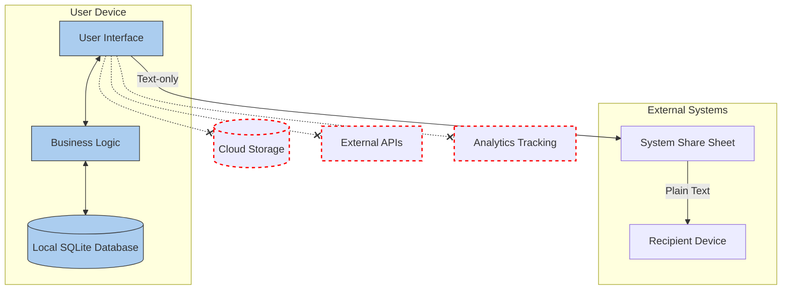

# Privacy: A Core Value

Checkmate was built with privacy as a foundational principle, not as an afterthought. This document outlines the privacy-focused architecture and the technical decisions that support it.

## Privacy Architecture

Checkmate uses a "zero-network" approach:



### Technical Implementation

1. **No Network Permissions**
   - App never requests internet access permissions
   - No network libraries or dependencies included
   - No API endpoints or services to secure

2. **Local-Only Storage**
   - All data stored in on-device SQLite database
   - Limited retention: max 30 bills, 12 recent participants
   - Automatic pruning of old data to limit storage growth

3. **No Authentication System**
   - No user accounts or login
   - No passwords to store or secure
   - No personal identifiers collected

4. **Limited Data Collection**
   - Only stores what the user explicitly enters
   - No device information gathered
   - No tracking or analytics

5. **Minimal Permissions**
   - Only permission used: system share sheet
   - No contact access
   - No location data
   - No camera access (until future OCR feature)

## Code Implementation

```dart
// Example showing database limitations to respect privacy
class AppDatabase extends _$AppDatabase {
  static const int maxRecentPeople = 12;
  static const int maxRecentBills = 30;
  
  // Automatic data pruning for privacy
  Future<void> addBill(RecentBillsCompanion bill) async {
    final count = await _getBillCount();
    if (count >= maxRecentBills) {
      await _removeOldestBill();
    }
    await into(recentBills).insert(bill);
  }
  
  // Clean data export that contains only essential information
  Future<String> exportBillAsText(int billId, ShareOptions options) async {
    final bill = await getBill(billId);
    final buffer = StringBuffer();
    
    // Only include the minimal necessary information based on user preferences
    if (options.includeHeader) {
      buffer.writeln("Bill from ${bill.date}");
      buffer.writeln("Total: \$${bill.total.toStringAsFixed(2)}");
      buffer.writeln();
    }
    
    // No identifying information included in exports
    // ...
    
    return buffer.toString();
  }
}
```

## Privacy-Related Trade-offs

### Trade-offs Accepted

1. **No Direct Payment Integration**
   - Most payment apps require user accounts and cloud integration
   - Solution: Text-based sharing that users can copy/paste into payment apps

2. **Limited History**
   - Without cloud backup, history is device-limited
   - Solution: Focused on recent history (last 30 bills) as most valuable

3. **Manual Entry**
   - No contact syncing means manual participant entry
   - Solution: Recent participants feature remembers last 12 people

4. **No Multi-Device Sync**
   - Data cannot sync between user's devices
   - Solution: Simple share format that works via messaging apps

### Privacy Benefits

1. **No Data Breaches Possible**
   - No server means no server vulnerabilities
   - No central database of user information to protect

2. **No Account Management**
   - No passwords to store securely
   - No account recovery or identity verification needed

3. **No Compliance Overhead**
   - Minimal GDPR/CCPA concerns with no data collection
   - No need for complex privacy policies or cookie notices

4. **User Trust**
   - Privacy becomes a marketable feature
   - Users confident their financial data stays private

## Future Privacy Enhancements

1. **Private OCR Processing**
   - Upcoming receipt scanning will use on-device ML models
   - No images will be sent to external services

2. **Enhanced Data Export/Deletion**
   - Tool to export or delete all user data
   - Full transparency about what is stored

3. **App Privacy Report Integration**
   - Support for iOS App Privacy Report
   - Visual confirmation of zero network activity

## Conclusion

Privacy in Checkmate isn't a marketing feature—it's a fundamental architectural decision that simplified development while creating user trust. By eliminating entire categories of privacy concerns through technical design, the app provides peace of mind alongside its core functionality.