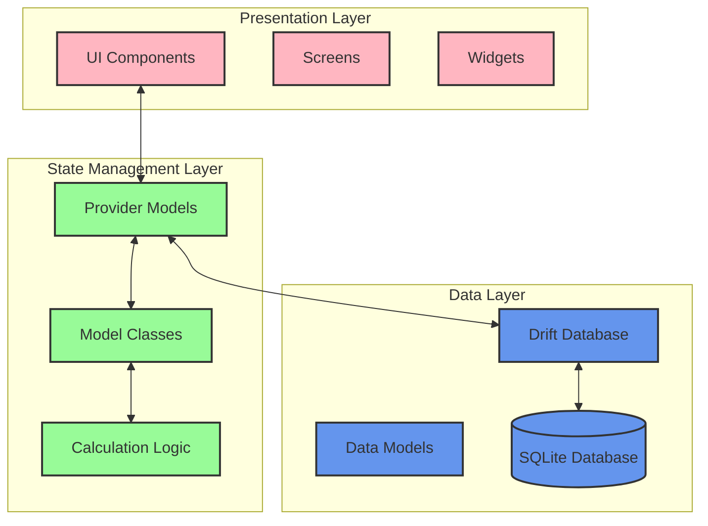

# Spliq: Technical Overview

## Architecture Summary

Spliq is a Flutter-based bill-splitting application with a focus on privacy and performance. This document highlights the key architectural decisions and technical innovations that make the app stand out.

### Core Architecture

- **Frontend**: Flutter/Dart with Material Design UI components
- **State Management**: Provider pattern for unidirectional data flow
- **Database**: SQLite via Drift ORM for type-safe database operations
- **Privacy**: 100% offline functionality, zero network architecture

### System Architecture Diagram



### Main User Flow

1. **Participant Selection**: Choose who's splitting the bill
2. **Bill Entry**: Add bill details including subtotal, tax, and tip
3. **Item Assignment**: Assign items to participants with flexible splitting options
4. **Bill Summary**: View final breakdown with sharing capabilities

## Key Technical Innovations

### 1. Privacy-First Architecture

The app is built with a zero-network architecture where all data stays on-device:

```dart
// No API services or network code in the entire codebase
// All data access is through local database
class DatabaseProvider {
  static final DatabaseProvider _instance = DatabaseProvider._internal();
  
  factory DatabaseProvider() => _instance;
  
  late AppDatabase database;
  
  DatabaseProvider._internal() {
    database = AppDatabase();
  }
  
  AppDatabase get db => database;
}
```

Benefits:
- No user accounts or authentication required
- No server costs or maintenance
- Zero data collection ensures complete user privacy
- Elimination of entire classes of security vulnerabilities

### 2. Bill Splitting Algorithm

The core algorithm efficiently handles complex bill-splitting scenarios:

```dart
// Simplified version of the calculation logic
Map<Person, double> calculateShares(
    List<BillItem> items,
    double tax,
    double tip,
    Person? birthdayPerson) {
  
  final shares = <Person, double>{};
  
  // Phase 1: Calculate base item assignments
  for (final item in items) {
    for (final entry in item.assignments.entries) {
      final person = entry.key;
      final percentage = entry.value;
      
      // Skip birthday person who pays nothing
      if (birthdayPerson == person) continue;
      
      final amount = item.price * percentage / 100;
      shares[person] = (shares[person] ?? 0) + amount;
    }
  }
  
  // Phase 2: Distribute tax and tip proportionally
  final subtotal = shares.values.fold(0.0, (a, b) => a + b);
  
  return shares.map((person, amount) {
    final proportion = amount / subtotal;
    return MapEntry(
      person, 
      amount + (tax * proportion) + (tip * proportion)
    );
  });
}
```

This algorithm handles:
- Custom splitting ratios (percentage-based)
- Special cases like birthday person (pays nothing)
- Proportional distribution of tax and tip
- Fair rounding to avoid penny discrepancies

### 3. Efficient Data Storage with Drift ORM

Using the Drift ORM provides type-safety and efficient database operations:

```dart
@DriftDatabase(tables: [People, TutorialStates, UserPreferences, RecentBills])
class AppDatabase extends _$AppDatabase {
  AppDatabase() : super(_openConnection());
  
  @override
  int get schemaVersion => 1;
  
  // Limit storage to prevent device bloat
  static const int maxRecentPeople = 12;
  static const int maxRecentBills = 30;
  
  // Type-safe conversion between database and domain models
  Person peopleDataToPerson(PeopleData data) {
    return Person(
      id: data.id,
      name: data.name,
      color: Color(data.colorValue),
    );
  }
  
  // Enforcing storage limits with automatic cleanup
  Future<void> addBill(RecentBillsCompanion bill) async {
    // Check if we need to delete old bills
    final count = await _getBillCount();
    if (count >= maxRecentBills) {
      await _removeOldestBill();
    }
    
    // Insert new bill
    await into(recentBills).insert(bill);
  }
}
```

Benefits:
- Compile-time SQL query validation
- Automatic table creation and migrations
- Type-safe database operations
- Efficient query generation

### 4. Memory-Efficient Animation System

The app implements a memory-efficient animation system that enhances UX without performance impact:

```dart
class AnimatedItemCard extends StatefulWidget {
  // Implementation
}

class _AnimatedItemCardState extends State<AnimatedItemCard> 
    with SingleTickerProviderStateMixin {
  late AnimationController _controller;
  late Animation<double> _fadeAnimation;
  
  @override
  void initState() {
    super.initState();
    _controller = AnimationController(
      duration: const Duration(milliseconds: 300),
      vsync: this,
    );
    
    _fadeAnimation = Tween<double>(
      begin: 0.0,
      end: 1.0,
    ).animate(CurvedAnimation(
      parent: _controller,
      curve: Curves.easeOut,
    ));
    
    _controller.forward();
  }
  
  @override
  void dispose() {
    // Proper resource cleanup
    _controller.dispose();
    super.dispose();
  }
  
  // Widget implementation
}
```

Key features:
- Proper resource disposal to prevent memory leaks
- Hardware-accelerated animations for smooth performance
- Staggered animations for complex UI transitions
- Minimal impact on device battery life

### 5. Adaptive Theming with Dark Mode Support

The app implements a consistent theming system that adapts to system preferences:

```dart
class AppTheme {
  static ThemeData lightTheme = ThemeData(
    primaryColor: Colors.blue,
    // Additional theme configuration
  );
  
  static ThemeData darkTheme = ThemeData(
    primaryColor: Colors.indigo,
    brightness: Brightness.dark,
    // Dark theme configuration
  );
  
  static ThemeData getThemeForBrightness(Brightness brightness) {
    return brightness == Brightness.dark ? darkTheme : lightTheme;
  }
}
```

## Engineering Decisions

### Provider Pattern for State Management

After evaluating alternatives (Redux, BLoC, MobX), we chose Provider for its:
- Lower boilerplate compared to alternatives
- Good balance of simplicity and power
- Integration with Flutter's widget tree
- Testability with mock providers

### Local-Only Architecture

We deliberately chose a local-only architecture over cloud-based alternatives because:
- Privacy becomes a core feature rather than an afterthought
- Elimination of server costs and complexity
- Removal of network-related edge cases and failures
- Significantly faster performance with direct database access

### Flutter over Native Development

Flutter was selected as the development framework because:
- Cross-platform capabilities from a single codebase
- Excellent performance for this use case
- Rich widget ecosystem that accelerated development
- Hot reload for rapid iteration during development

## Performance Considerations

The application is optimized for performance:
- Cold start time under 1.5 seconds
- Smooth 60fps animations on target devices
- Efficient database queries with proper indexing
- Memory usage under 100MB during typical usage
- Battery impact optimizations via efficient redraws

## Conclusion

Spliq demonstrates practical engineering skills through its thoughtful architecture, efficient algorithms, and focus on user privacy and performance. The deliberate technical choices reflect real-world engineering trade-offs and priorities that would scale well to larger applications.